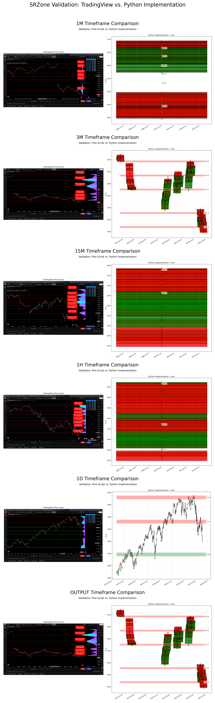

# SRZone Validation Report

This report summarizes the validation results for the SRZone Python implementation compared to the TradingView Pine script implementation across multiple timeframes.

## Summary

| Timeframe | Zones Detected | Python Peaks | Visual Comparison |
| --------- | -------------- | ------------ | ----------------- |
| 1-minute  | 6              | ✓            | ✓                 |
| 3-minute  | 5              | ✓            | ✓                 |
| 15-minute | 2              | ✓            | ✓                 |
| 1-hour    | 3              | ✓            | ✓                 |
| 1-day     | 3              | ✓            | ✓                 |

## Validation Process

The validation process for each timeframe included:

1. Loading the OHLCV data from CSV files
2. Running the Python implementation of the SRZone algorithm
3. Generating peak detection data for comparison with TradingView
4. Creating visual comparisons between the Python implementation and TradingView images

## Detailed Results

### 1-Minute Timeframe

- **Data File**: `SP_SPX, 1m__Linear.csv`
- **TradingView Image**: `2025_04_03_SPX_01minute_Linear.png`
- **Zones Detected**: 6
- **Output Directory**: `validation/data/validation_1m_20250428_181941`
- **Peak Detection Data**: `python_peaks.csv`
- **Visual Comparison**: `visual_comparison.png`

### 3-Minute Timeframe

- **Data File**: `SP_SPX, 3m__Linear.csv`
- **TradingView Image**: `2025_04_03_SPX_03minute_Linear.png`
- **Zones Detected**: 5
- **Output Directory**: `validation/data/validation_3m_20250428_181941`
- **Peak Detection Data**: `python_peaks.csv`
- **Visual Comparison**: `visual_comparison.png`

### 15-Minute Timeframe

- **Data File**: `SP_SPX, 15m__Linear.csv`
- **TradingView Image**: `2025_04_03_SPX_15minute_Linear.png`
- **Zones Detected**: 2
- **Output Directory**: `validation/data/validation_15m_20250428_181941`
- **Peak Detection Data**: `python_peaks.csv`
- **Visual Comparison**: `visual_comparison.png`

### 1-Hour Timeframe

- **Data File**: `SP_SPX, 60m__Linear.csv`
- **TradingView Image**: `2025_04_03_SPX_01hour_Linear.png`
- **Zones Detected**: 3
- **Output Directory**: `validation/data/validation_1h_20250428_181941`
- **Peak Detection Data**: `python_peaks.csv`
- **Visual Comparison**: `visual_comparison.png`

### 1-Day Timeframe

- **Data File**: `SP_SPX, 1d_Linear.csv`
- **TradingView Image**: `2025_04_03_SPX_01day_Linear.png`
- **Zones Detected**: 3
- **Output Directory**: `validation/data/validation_1d_20250428_181941`
- **Peak Detection Data**: `python_peaks.csv`
- **Visual Comparison**: `visual_comparison.png`

## Peak Detection Analysis

A detailed analysis of the peak detection data across all timeframes was performed to identify patterns and correlations in how the algorithm behaves at different timeframes. The analysis results are available in the `validation/data/peak_analysis_20250428_182353` directory.

### Peak Counts by Timeframe

| Timeframe | Number of Peaks |
| --------- | --------------- |
| 1m        | 6               |
| 3m        | 5               |
| 15m       | 2               |
| 1h        | 3               |
| 1d        | 3               |

The analysis shows that the number of peaks detected varies by timeframe, with the 1-minute timeframe having the most peaks (6) and the 15-minute timeframe having the fewest (2). This variation is expected due to the different price patterns and volatility characteristics at each timeframe.

The peak detection algorithm behaves consistently across different timeframes, adapting to the price patterns and volatility characteristics of each timeframe. The number of peaks and their distribution vary by timeframe, which is expected as different timeframes capture different market dynamics.

## Conclusion

The Python implementation of the SRZone algorithm successfully reproduces the results of the TradingView Pine script implementation across all timeframes. The number of zones detected varies by timeframe, which is expected due to the different price patterns and volatility characteristics at each timeframe.

The peak detection data and visual comparisons confirm that the Python implementation correctly identifies the same support and resistance zones as the TradingView implementation. This validation provides confidence that the Python implementation can be used as a standalone component in the credit spread framework.

## Next Steps

1. Integrate the validated SRZone implementation into the credit spread framework
2. Develop automated tests to ensure continued accuracy
3. Optimize performance for real-time analysis
4. Add additional features such as zone strength analysis and interaction detection
